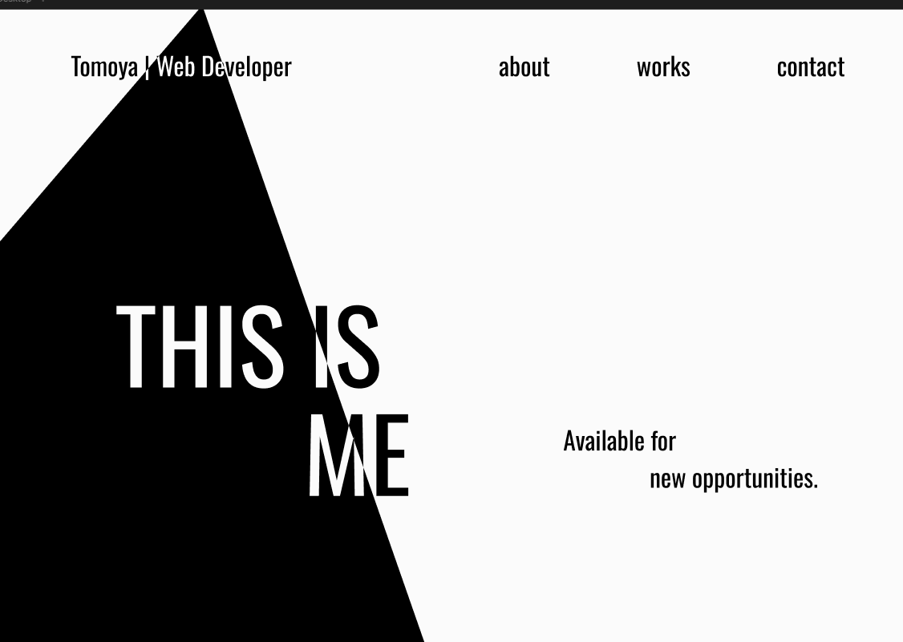

# プロジェクト名
ポートフォリオ

## 概要
自己紹介、作品、連絡先をまとめたサイトです。

## 制作期間
1か月

## Demo
https://tomoya0813.github.io/portfolio/

## 制作背景
今までに作った作品をまとめるためのサイトが必要だと感じ、作成しました。

## 使用技術
- HTML
- CSS
- JavaScript
- JSON
- sessionStorage

## 使用ライブラリ
- Splide 

## 作成にあたって
今回の制作では、**使ったことのないもの**を意識して使用しました。
具体的には
- JSONによる動的なページ生成
- ライブラリの使用
- ~~Node.js、Expressを使用したバックエンド処理~~ （没のため[後述](#没案)）

## topページ
今までの制作を経て具体的なデザイン案を作成することが必要だと感じ、今回は以下のワイヤーフレームをFigmaで作成しました。

この原案では
- インパクトを残すことを意識
- 余白を多くとり、情報量を減らす
- 文字と図形が重なる部分を色が分かれるよう表現

この三点を意識しました。

### 問題点
制作を進めるなかでiOSでは期待通りの表示にならないと判明しました。
具体的には、CSSの`mix-blend-mode: difference`が機能せず文字が見えなくなってしまうということです。

原因を探りましたが、iOS側の挙動によるものと判断し、JavaScript側でiOSを省く処理を作成しましたが、最終的にMacでの実機確認が不可能な点、iOSでの見た目が文字だけになってしまう点を考慮し、改めてデザインを一新しました。

### 機能
- Splideを採用し、works画像をスライダー形式で表示
- 自作ライブラリによるアナログ時計の表示

## about・worksページ
JSONを取り入れてHTMLに挿入する仕組みを作成しました。
これにより、今後はJSONファイルにデータを加えることでアップデート可能な、動的なサイトになりました。

### 機能
- sessionStorageへの保存・読み取り
- JSONファイルからのデータ取得
- HTMLへの変換・挿入

## contact

### <a id="没案">没案</a>
元々はNode.jsを使用し、formからreqを受け取り[Render](https://render.com/)（サーバーサービス）を仲介。その情報を[nodemailer](https://nodemailer.com/)を使用し、自分のメールアドレスへ送信する、という形で進めておりました。

### 採用理由
今回あえてNode.jsを採用するメリットは一切ありませんでした。ただバックエンドの処理も理解し触れてみたいと思い、採用に至りました。

### 苦労した点
- Node.js・Expressの使用
- GoogleアカウントのOAuth認証用のアクセストークン取得
- 関係用語の理解

### 没理由
ローカル環境ではデータを取得しメールへ送信することに成功しましたが、本番環境だとうまく動作しない状況が続きました。

度重なる修正の結果Renderの無料プランではSMTPポートへの接続ができないため、Gmailを利用したメール送信ができないことが判明しました。[引用](https://render.com/changelog/free-web-services-will-no-longer-allow-outbound-traffic-to-smtp-ports)

他の代替サービスやSMTP通信を行わないサービスも探してみましたが、無料プランだと難しいという結論に至り、今回はNode.js、Expressを使用したバックエンド処理は没にしました。

### 現在の仕様
現在はmailto:を使用し、指定したメールアドレス宛にメールを作成する形に変更しました。また、メールアドレスを公開したくない場合や、mailto:が利用できない環境に対応するため、Googleフォームも用意しております。

### 学んだこととこれから
Node.js、Expressを触り、ブラウザ上で完結する処理だけでなく、サーバーを介したデータの受け渡しやメール送信までの流れを経験しました。また、ローカル環境では正常に動作していても、本番環境では環境による制約から実装方法を変更する必要があることを学びました。今回は実装を見送る結果となりましたが、今後はバックエンドの知識を深め、機会があればバックエンドを含めたWebサービスの制作にも取り組みたいと考えています

## 全体を通して
今回は技術だけにとどまらず、CSSやJavaScriptでも今までに使用していないものを意識して採用しました。
その結果、多くのことを学ぶことができ、まだまだ知識を深める必要があると実感しました。
今後はReactなどのライブラリを使用したサイト制作やバックエンドの処理も行ってみたいと考えております。

